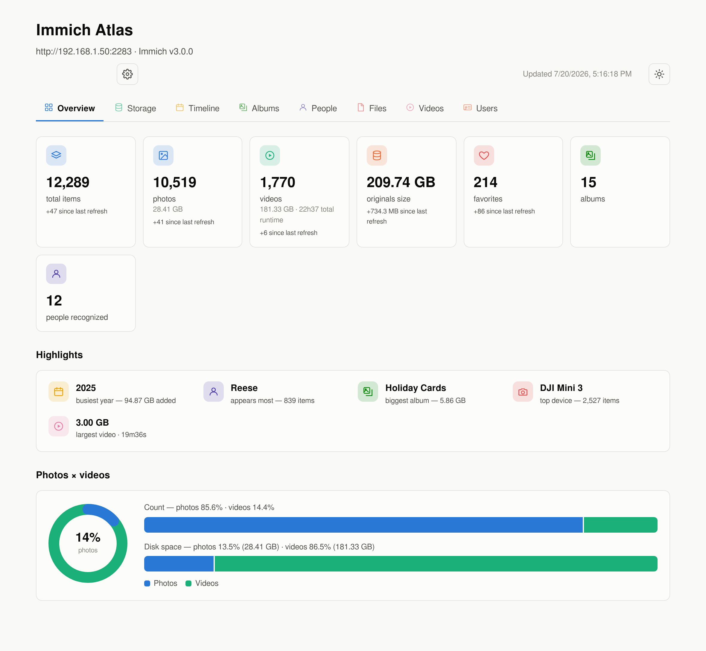
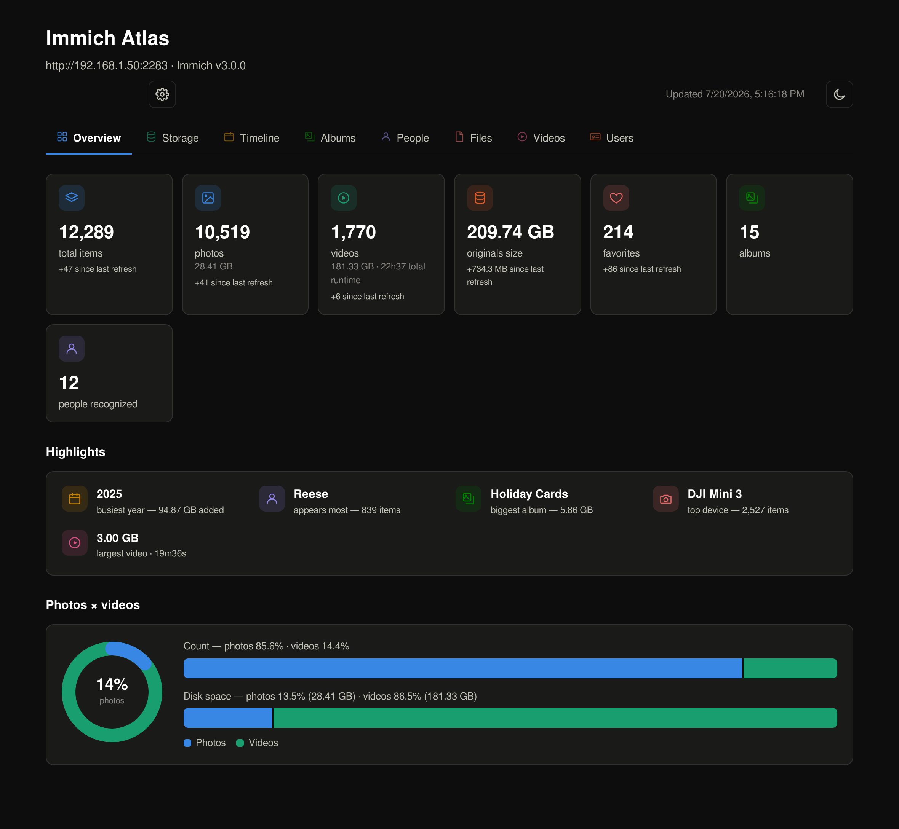
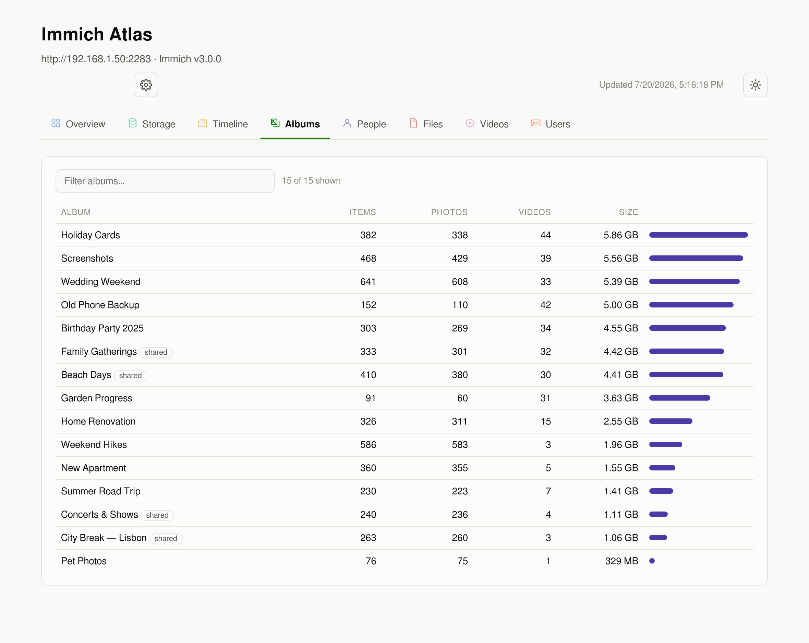
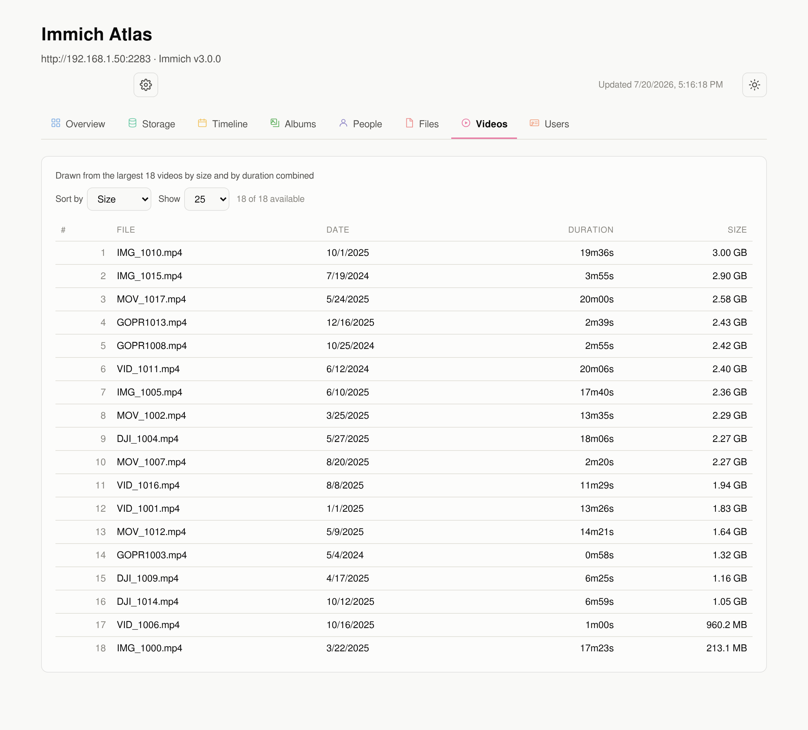
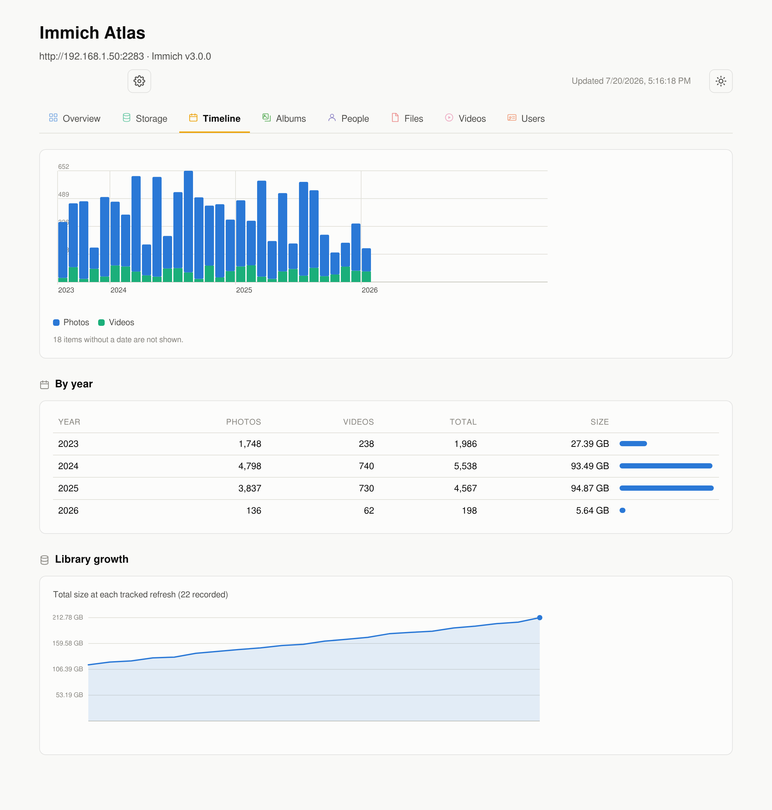

# Immich Atlas

**Storage & library analytics dashboard for your [Immich](https://immich.app) server.**

*An unofficial, community-built companion tool — not affiliated with or endorsed by the
Immich project. The icon combines the [official Immich logo](https://github.com/immich-app/immich)
with a magnifying-glass badge to signal "analytics for Immich."*

Immich shows you your photos. Atlas shows you your *library*: where the space goes,
how it grew over the years, which albums and people weigh the most, and what is
actually sitting on your disk.

- 📊 Photos × videos — count and disk space breakdown, with a donut at a glance
- ⭐ Highlights — busiest year, who appears most, biggest album, top device, largest video
- 📈 Library growth chart across tracked refreshes, plus a delta on every Overview tile
  since the last refresh
- 💾 Disk usage by folder (originals, transcoded videos, thumbnails, DB backups)
- 📅 Timeline of your library, month by month, back to your oldest photo
- 🖼️ Album sizes — items, photos/videos split and real disk usage per album, searchable
- 🧑 People — who appears most, how much space those items take, searchable
- 🎬 Largest videos, sortable by size or duration, with a configurable row count
- 📁 File types and cameras/devices
- 👥 Per-user storage usage (multi-user servers, with an admin API key)
- 🔗 Album/person/video rows deep-link straight to that item in Immich
- 🔄 Auto-refreshes on a schedule (default: every 24h) + manual refresh button
- 🌗 Light/dark theme with a real toggle (not just "follows the OS"), color-coded
  tabs, no external dependencies, single tiny container

Everything is read-only: Atlas only calls the Immich HTTP API (and optionally
reads the upload folder from a read-only mount). It never modifies your library.

## Screenshots

*Populated with synthetic demo data — not a real library.*

<p>
  
  
</p>
<p>
  
  
</p>
<p>
  
</p>

## Quick start (Docker)

```yaml
services:
  immich-atlas:
    image: ghcr.io/guimartins/immich-atlas:latest
    container_name: immich-atlas
    restart: unless-stopped
    ports:
      - "2284:8080"
    volumes:
      - ./data:/appdata
      # Optional — enables the "disk usage by folder" section:
      # - /path/to/immich/upload:/upload:ro
```

```bash
docker compose up -d
```

Open `http://your-server:2284`, paste your Immich URL and an API key
(Immich → **Account Settings → API Keys**), and hit **Save & connect**.
The first collection takes a few minutes on large libraries.

### CasaOS / ZimaOS

A ready-to-use app manifest lives in [`casaos/docker-compose.yml`](casaos/docker-compose.yml).
Install it via *Custom Install* by importing that compose file, or through the
BigBear app store once published there.

> **Don't `docker run` / plain `docker compose up` it directly on CasaOS/ZimaOS.**
> A container started outside CasaOS's own app manager shows up as a generic
> "Legacy app" with no icon and no working "open" button, even though the app
> itself runs fine. Install it through the CasaOS UI (*Custom Install* → paste
> the compose file) or with `casaos-cli app-management install -f docker-compose.yml`
> so CasaOS picks up the `x-casaos` metadata (icon, title, web UI port).

## Configuration

Everything can be configured in the web UI. Environment variables are optional
overrides (they take precedence and lock the corresponding UI field):

| Variable | Default | Description |
|---|---|---|
| `IMMICH_URL` | — | Immich server URL, e.g. `http://192.168.1.10:2283` |
| `IMMICH_API_KEY` | — | Immich API key |
| `REFRESH_HOURS` | `24` | Auto-refresh interval in hours |
| `UPLOAD_DIR` | `/upload` | Where the Immich upload folder is mounted (read-only) |
| `DATA_DIR` | `/appdata` | Where settings and the cached report are stored |
| `PORT` | `8080` | HTTP port inside the container |

### Notes

- **API key scope**: a regular user key shows that user's library. Use a key
  from an **admin** account to get server-wide statistics and the per-user table.
- **Disk section**: only appears when the Immich upload folder is mounted at
  `/upload`. Mount it read-only (`:ro`) — Atlas never writes to it.
- **Security**: the web UI has no authentication — treat it like your other
  LAN-only dashboards and don't expose the port to the internet. The API key is
  stored in `/appdata/config.json`.
- **Compatibility**: tested against Immich v3. Older versions (v1.1xx) should
  work for most sections since Atlas falls back gracefully when an endpoint
  changes shape.

## Development

No build step, no dependencies — the app is a single Node.js file plus one HTML file:

```bash
IMMICH_URL=http://localhost:2283 IMMICH_API_KEY=xxx DATA_DIR=./data node app/server.js
```

## License

[MIT](LICENSE)
